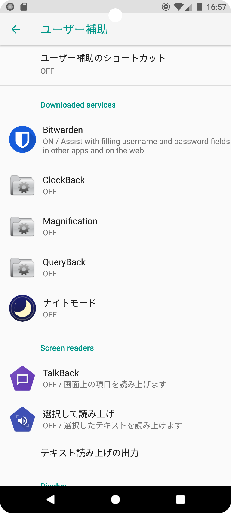
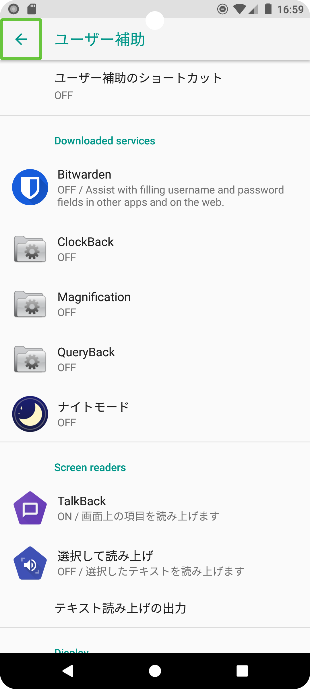

# Navigation TalkBack Crash

## Environment
- Below SDK31 (Android 8.1)

Version confirmed by emulator.
- 9.0  
- 8.1  
- 8.0(crash)  
- 7.1.1(crash)  

Set up Bitwarden, TalkBack, etc.
<table>
<tr>
<td>BitWaden</td>
<td>TalkBack</td>
</tr>
<tr>
<td></td>
<td></td>
</tr>
</table>

## Step
- Handle Focus with AndroidView inside Compose.  
- call popBackStack or navigate.  
- Crash.  
